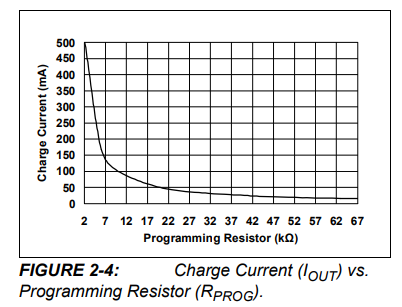
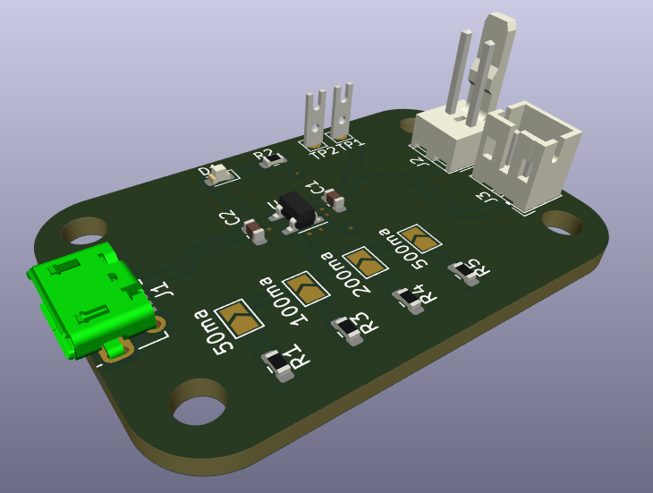
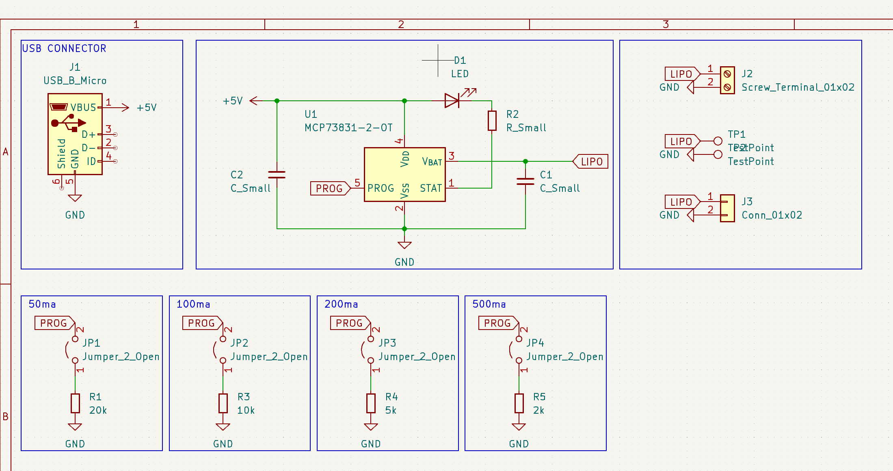
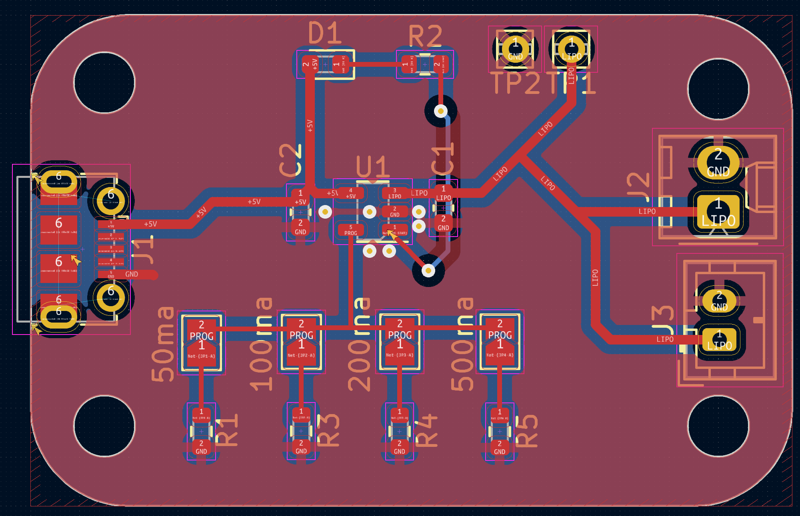

# Lipo charger with mcp73831 and multiple charging speed

## this project use MCP73831 for charging lipo with multiple type of connectors.

### Charging speed selector
- 50ma use 20k resistor
- 100ma use 10k resistor
- 200ma use 5k resistor
- 500ma use 2k resistor
### You can change resistor with help of this grah (see datasheet for more info [HERE](https://ww1.microchip.com/downloads/en/DeviceDoc/MCP73831-Family-Data-Sheet-DS20001984H.pdf))


#### really easy calculator
```javascript
const charging_speed = 500 // set here your charging speed desired in milliamps
if (charging_speed > 500) 
    alert("Can't charge more than 500ma")
else
    alert(1000/(charging_speed/1000)+"Ohm")
```

### 3d view


### Schematic screenshot


### Pcb screenshot

